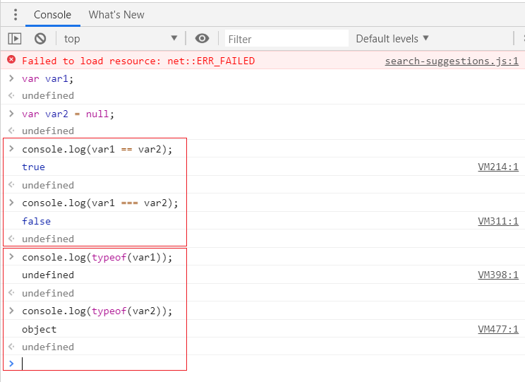

기본 문법
=====
[강의](https://www.youtube.com/watch?v=FOli-PU8tTo&list=PLBXuLgInP-5kLy13XLuK8iBWVFDBJygYr&index=3)는 링크를 통해 확인할 수 있다.
- - -
## 목차
1. [요약](#요약)
	* [기본용어](#기본용어)
	* [자료형](#자료형)
		* [종류](#종류)
		* [변환](#변환)
		* [연산자](#연산자)
	* [변수](#변수)
2. [참고](#참고)

## 요약

### 기본용어
* 표현식
	* 자바스크립트에서 값을 만들어내는 간단한 코드  
		```javascript
		273
		10 + 20 + 30 * 2
		'RintIanTta'
		```
* 문장
	* 하나 이상의 표현식이 모인 것으로, 문장 끝에는 세미콜론을 찍어 문장의 종결을 알림  
		```javascript
		10 + 20 + 30 * 2;
		var rintiantta = 'Rint' + 'Ian' + 'Tta';
		alert('Hello JavaScript');
		273;
		```
	* 사실 자바스크립트 문장 끝에 세미콜론을 입력하지 안하도 프로그램 실행 시 문제 없지만 관례상 입력함
* 키워드
	* 자바스크립트가 처음 만들어질 때 정해진 특별한 의미가 있는 단어
	* 예  
		`break	else	instanceof	true	case`
* 식별자
	* 자바스크립트에서 이름을 붙일 때 사용하는 단어(ex. 변수명, 함수명)
		* 식별자를 사용하면 안 됨
		* alpha, beta처럼 의미 없는 단어보다 input, output 같은 의미 있는 단어 사용 권장
		* 식별자로 한글이나 한자, 일본어 같은 언어를 모두 사용할 수 있으나 알파벳을 사용하는 것이 개발자 사이의 관례
	* 예  
		```javascript
		alpha
		alpha10
		_alpha
		$alpha
		AlPha
		```
	* 외 관례(식별자의 의미를 더 명확하게 하려고 사용하는 규칙)
		* 생성자 함수의 이름은 항상 대문자로 시작
		* 변수와 인스턴스, 함수, 메서드의 이름은 항상 소문자로 시작
		* 여러 단어로 이루어진 식별자는 각 단어의 첫 글자를 대문자로 작성
	* 구분  
		```javascript
		alert('Hello World');		// 함수(alert)
		Array.length;			// 속성(length)
		input				// 변수
		prompt('Message', 'Defstr');	// 함수(prompt)
		Math.PI			// 속성(PI)
		Math.abs(-273);		// 메서드(abs)
		```
* 주석
	* 프로그램 코드를 설명하는 데 사용
	* 프로그램을 진행하는 데 전혀 영향을 주지 않음
	* 예
		* HTML 주석  
			```html
			<!DOCTYPE html>
			<html>
			<head>
				<!-- 주석입니다. -->
				<script>
				</script>
			</head>
			<body>
				<!-- <h1>주석입니다.</h1> -->
			</body>
			</html>
			```
		* 자바스크립트 주석  
			```javascript
			<script>
				// 주석은 코드 실행에 아무 영향을 미치지 않습니다.
				/*
				alert('Hello JavaScript');
				alert('Hello JavaScript');
				alert('Hello JavaScript');
				*/
			</script>
			```
##### [목차로 이동](#목차)
		
### 자료형
#### 종류
* 자바스크립트의 자료형
	* 책에 의하면 총 여섯 가지 자료형 존재  
		```javascript
		<script>
		// 변수를 선언합니다.
		var stringVar = 'String';
		var numberVar = 273;
		var booleanVar = true;
		var functionVar = function() { };
		var objectVar = {};
		// 추가로 undefiend 자료형이 존재한다.
		</script>
		```
	* [MDN web docs](https://developer.mozilla.org/ko/docs/Web/JavaScript/Data_structures)에 의하면 최신 ECMAScript 표준은 7개의 자료형을 정의
		* [기본 자료형](#기본-자료형)
			* Boolean
			* [Null](#Null-vs-Undefined)
			* [Undefined](#Null-vs-Undefined)
			* Number
			* [String](#String)
			* Symbol(ECMAScript6에 추가됨)
		* 별도로 Object도 존재

##### [목차로 이동](#목차)
		
##### 기본 자료형
오브젝트를 제외한 모든 값은 변경 불가능한 값(immutable value)이다. 예를 들자면, 특히 C 언어와는 다르게도, 문자열은 불변값(immutable)이다. 이런 값을 `primitive values`라고 일컫는다.

* Immutable
	* [자바](https://limkydev.tistory.com/68)
	* [자바스크립트](http://blog.naver.com/PostView.nhn?blogId=wj8606&logNo=221209820504)

##### [목차로 이동](#목차)
	
##### Null-vs-Undefined
* 공통점
	* 둘 다 데이터 타입이자, 값(`값이 없음`을 나타냄)임
* 차이점
	* undefined는 변수만 선언하더라도 할당되지만 null은 변수를 선언한 후에 null로 값을 바꿈
		* 즉, null은 아무 것도 없는 값이 저장되어 있는 것이고 undefined는 값이 저장되어 있지 않은 것임
	* 예
		* undefined  
			```javascript
			var foo;		// foo 변수에 undefined가 할당
			```
		* null  
			```javascript
			var foo = null;	// foo 변수에 null가 할당
			```
* 비교  
	 

##### [목차로 이동](#목차)
	
##### String
문자열을 복잡한 자료형을 표현하는 용도로 쓰는 방법이 꽤나 매력적일 수 있다. **단기적으로** [이런 장점들](https://developer.mozilla.org/ko/docs/Web/JavaScript/Data_structures)이 있다.

* 문자열은 디버깅이 쉽다(화면에 출력한 내용이 문자열 변수에 있는 값과 같다)
* 문자열은 많은 API에서 사용하는 공통분모이고(입력 필드, 로컬 스토리지 값, `XMLHttpRequest` 요청에서 `responseText`를 사용할 때 등) 그러다보니 문자열만으로 작업하는게 매혹적일 수 있다

규칙만 잘 정의해놓는다면, 어떤 자료구조가 되던 문자열로 표시할 수 있지만 그렇다고 해서 이게 좋은 방법이 되는 건 아니다. 예를 들자면, 구분자로 리스트 자료형을 흉내낼 수 있을 것이다(하지만 자바스크립트의 배열을 사용하는게 더 알맞을 것이다).

* 참고
	* [XMLHttpRequest](https://developer.mozilla.org/ko/docs/Web/API/XMLHttpRequest)

##### [목차로 이동](#목차)

#### 변환
느슨한 타입의 언어기 때문에 변환을 고려해야 하고, 일치 연산자(`==` 혹은 `===`)도 구분해서 사용해야 한다.

* [자바스크립트에서 **불 자료형 변환이** false로 간주되는 것들](https://studymake.tistory.com/484)
	* 불 자료형 변환을 하지 않은 것은 결과가 다를 수 있음
* 숫자와 문자열 자료형 변환
	* [추후 추가]()
	
##### [목차로 이동](#목차)

#### 연산자
* 피연산자의 종류에 따라 연산자의 특성이 달라짐  
	```JavaScript
	<script>
		// 1번 문제
		var value = 10;
		value += 20;
		alert(value);
		
		// 2번 문제
		var value = 'Hello' + '..!';
		alert(value + ' JavaScript');
	</script>
	```
* 자료형 검사
	* 단항 연산자인 `typeof` 사용
	* 괄호를 사용해서 범위를 명확히 하는 것을 권장(함수와 비슷한 생김새 때문에 오해)  
		```javascript
		typeof 1 + '문자열'
		typeof(1 + '문자열')
		typeof(1) + '문자열'
		```

##### [목차로 이동](#목차)

### 변수
[자바스크립트](https://developer.mozilla.org/ko/docs/Web/JavaScript/Data_structures)는 `느슨한 타입(loosely typed)` 언어, 혹은 `동적(dynamic)` 언어이다. 그 말은, 변수의 타입을 미리 선언할 필요가 없다는 뜻이다. 타입은 프로그램이 처리되는 과정에서 자동으로 파악될 것이다. 또한 그 말은 같은 변수에 여러 타입의 값을 넣을 수 있다는 뜻이다.

```javascript
var foo = 42;		// foo는 이제 Number임
var foo = "bar";	// foo는 이제 String임
var foo = true;		// foo는 이제 Boolean임
```

자바스크립트는 위처럼 기존에 존재하는 변수를 재선언할 수 있다.

##### [목차로 이동](#목차)

## 참고
* [MDN 자바스크립트 가이드](https://developer.mozilla.org/ko/docs/Web/JavaScript)

##### [목차로 이동](#목차)