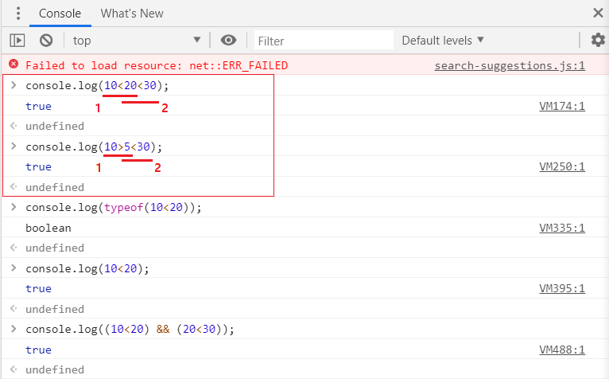

조건문과 반복문
=====
[강의](https://www.youtube.com/watch?v=FOli-PU8tTo&list=PLBXuLgInP-5kLy13XLuK8iBWVFDBJygYr&index=3)는 링크를 통해 확인할 수 있다.
- - -
## 목차
1. [조건문](#조건문)
	* [개요](#개요)
	* [if문](#if문)
	* [switch문](#switch문)
	* [기타](#기타)
2. [반복문](#반복문)
	* [개요](#개요)
	* [while문](#while문)
	* [for문](#for문)
3. [참고](#참고)
	
## 조건문

### 개요
* 조건문이란
	* 프로그래밍 언어의 흐름을 변경할 수 있는 제어문 중 하나
	* 흔히 게임(주로 나는 [헥스볼](https://html5.haxball.com/)만 하니까 여기서 봤음)에서 보이는 [봇](https://namu.wiki/w/%EB%B4%87)방도 이게 가장 기본 원리
		* 사용자의 입력에 따라 다른 결과를 보여주는 매크로 프로그램
* 종류
	* 두 종류(if문, switch문)가 있는데 보통 if문이 많이 쓰인다고 함
	* 범위를 조건으로 가지는 if 조건문을 switch 조건문으로 대체하기 까다로움
		* 반면 모든 switch 조건문은 if 조건문으로 대체 가능

##### [목차로 이동](#목차)

### if문
사용법은 다른 언어와 비슷한듯 하니, 간단하게 생각했던 점 몇 가지만 기록한다.

* 불 표현식
	* 코드  
		```javascript
		// 방법1
		if(10 < x < 20) { }
		
		// 방법2
		if((10 < x) && (x < 20)) { }
		```
	* 방법2
		* 컴퓨터는 방법2를 사용해야 이해함(연산자간 우선순위 등 고려)
			

##### [목차로 이동](#목차)

### switch문
* 기본 형태(`default` 키워드 부분은 생략 가능)  
	```javascript
	switch (<비교할 값>) {
		case <값>:
			<문장>
			break;
		case <값>:
			<문장>
			break;
		default:
			<문장>
			break;
	}
	```
	* break 키워드
		* `switch 조건문`이나 `반복문`을 빠져나가려고 사용하는 키워드
			* `if 조건문`은 해당 없음

##### [목차로 이동](#목차)

### 기타
* 삼항 연산자
	* if 조건문과 switch 조건문 외에도 삼항 연산자 조건문이 있음
		* 연산자지만 프로그램의 실행을 조건에 따라 변화시킬 수 있으므로 조건문으로 분류
	* 기본 형태  
		```javascript
		<불 표현식> ? <참일 때 실행하는 문장> : <거짓일 때 실행하는 문장>
		```
	* 주로 코드를 짧게 쓰려는 개발자가 자주 사용
* 짧은 조건문
	* 논리 연산자의 특성을 조건문으로 사용
		* 다른 조건문 코드와 비교했을 때 이해하기 어려우므로 많이 사용하진 않음
	* 기본 형태  
		```javascript
		// 논리합 연산자를 사용
		(<불 표현식>) || (<불 표현식이 거짓일 때 실행할 문장>)
		
		// 논리곱 연산자를 사용
		(<불 표현식>) && (<불 표현식이 참일 때 실행할 문장>)
		```
	* 예  
		```javascript
		<script>
			// 변수를 선언합니다.
			var input = Number(prompt('숫자를 입력해주세요.', '숫자'));
			
			// 조건문
			input % 2 == 0 || alert('홀수입니다.');
			input % 2 == 0 && alert('짝수입니다.');
		</script>
		```

##### [목차로 이동](#목차)

## 반복문

### 개요
* 반복문이란
	* 조건문과 함께 제어문의 하나로, 컴퓨터에게 반복작업을 시키는 문
	* 배열(문자열과 비슷) 자료구조와 함께 사용되는 경우가 많음
		* 자바와 달리 자바스크립트의 배열은 길이 고정 아님  
			```javascript
			<script>
				// 배열을 생성합니다.
				var array = [0, 1];
				
				// 배열에 요소를 추가합니다.
				array.push(2);
				array.push(3);
				
				// 출력합니다.(?????)
				alert(array);
			</script>
			```
		* 명명법이 애매한 부분이 있음(메소드명이 `remove`가 아닌 `splice`)
		* 문자열도 배열처럼 `length` 속성이 있으며 인덱스로 각 글자에 접근 가능  
			```javascript
			<script>
				var a = "abcdefg";
				alert(a.length);
				
				alert(a[0]);
				alert(a[1]);
				alert(a[2]);
			</script>
			```
		* 어떠한 종류의 자료형도 요소가 될 수 있음(자바와 다르게 유연함)  
			```javascript
			<script>
				// 변수를 선언합니다.
				var array = [273, 'String', true, function(){ }, {}, [273, 103]];
				
				// 출력합니다.(????)
				alert(array);
			</script>
			```
* 종류
	* 두 종류(while문, for문)가 있음

##### [목차로 이동](#목차)

### while문
* 기본 형태  
	```javascript
	while(<불 표현식>) {
		<문장>
	}
	```
* while문의 조건을 변화시키는 방법
	* 내부에서 조건 변경  
		```javascript
		<script>
			var value = 0;
			
			while(value < 5) {
				alert(value + '번째 반복');
				value++;
			}
		</script>
		```
	* 외부에서 조건 변경  
		```javascript
		<script>
			var value = 0;
			var startTime = new Date().getTime();
			
			while(new Date().getTime() < startTime + 1000){
				value++;
			}
			
			alert(value);
		</script>
		```
* do while 반목문
	* 자주 사용하지 않음
	* 기본 형태  
		```javascript
		{
			<문장>
		} do while(<불 표현식>);
		```

##### [목차로 이동](#목차)

### for문
while 반복문이 조건에 비중을 두는 반복문이라면, for 반복문은 조건보다 횟수에 비중을 둘 때 사용하는 반복문이다.

1. for 반복문
	* 기본 형태  
		```javascript
		for(var i = 0; i < <반복횟수>; i++) {
			<문장>
		}
		
		// 예
		var array = ['포도', '사과', '바나나', '망고'];
			
		for(var i = 0; i < array.length; i++){
			alert(array[i]);
		}
		```
	* 설명
		* 0으로 시작해서 length 바로 전까지 반복 실행하는 이유는 배열의 인덱스가 0에서 시작하기 때문
		* 이뿐만 아니라 대부분의 프로그래밍 언어에서 `월`을 셀 때도 1이 아닌 0부터 셈
2. for in 반복문
	* 기본 형태  
		```javascript
		for(var <반복 변수> in <배열 또는 객체>) {
			<문장>
		}
		
		// 예
		var array = ['포도', '사과', '바나나', '망고'];

		for(var i in array) {
			alert(array[i]);
		}
		```
	* 설명
		* 자바스크립트는 배열이나 객체를 더욱 쉽게 다룰 수 있게 for in 반복문 제공  
		  (객체의 key값과 value값을 뽑아내는데 유용)
		* 단, 자바([향상된 for문](https://library1008.tistory.com/66))와 다르게 변수의 요소가 아닌 인덱스를 빼서 온다는 특징이 있음
			* 자바의 향상된 for문은 Read only임(수정 불가)
3. for of 반복문
	* 기본 형태  
		```javascript
		// for of문
		for(variable of iterable) {
			statement
		}
		
		// for in문
		for (variable in object) { ... }
		```
	* 설명
		* for of 반복문은 배열 이외에도 다양한 것(문자열, 맵, 세트 등)과 조합해서 사용할 수 있음  
		  (for of 반복문은 ES6에 추가된 새로운 컬렉션 전용 반복 구문)
		* for of 구문을 사용하기 위해선 컬렉션 객체가 Symbol.iterator 속성을 갖고 있어야 함
4. foreach문
	* 기본 형태  
		```javascript
		var fruits = ["Apple","Banana","Orange","Strawberry"];
		fruits.forEach(function (item, index, array) {
			console.log(item, index);
		});
		```
	* 설명
		* 오직 Array 객체에서만 사용 가능한 메소드  
		  (ES6부터는 Map, Set 지원)
		* forEach 구문의 각 인자로 콜백 함수를 등록할 수 있고, 배열의 각 요소들이 반복될 때 이 콜백 함수가 호출

- - -
for in 반복문과 for of 반복문에 관해 살펴본다.

* for in 반복문 - ECMAScript 5  
	```javascript
	<script>
		var array = [1, 2, 3, 4];
		for(var i in array) {
			alert(i + "번째 요소는 " + array[i] + "입니다.");
		}
	</script>
	```
	* 객체의 모든 열거 가능한 속성에 대한 반복
* for of 반복문 - ECMAScript 6  
	```javascript
	<script>
		for(const element of [1, 2, 3, 4]){
			alert(`요소는 ${element}입니다.`); // 템플릿 문자열 - ECMAScript 6
		}
	</script>
	```
	* Symbol.iterator 속성을 가지는 컬렉션 전용
* 단, for of 반복문은 현재 몇 번 반복했는지 알 수 없음  
	```javascript
	<script>
		let i = 0;
		for(const element of [1, 2, 3, 4]) {
			alert(`${i}번째 요소는 ${element}입니다.`);
			i++;
		}
	</script>
	```
	* 따라서 따로 변수를 만들어서 확인해야 함

##### [목차로 이동](#목차)

## 참고
* 반복문 비교
	* [for ... of](https://developer.mozilla.org/ko/docs/Web/JavaScript/Reference/Statements/for...of)
	* [for ... in](https://developer.mozilla.org/ko/docs/Web/JavaScript/Reference/Statements/for...in)

##### [목차로 이동](#목차)