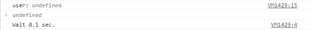
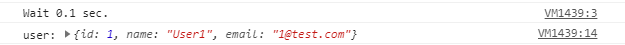

함수
=====
* [강의 링크](https://www.youtube.com/watch?v=FOli-PU8tTo&list=PLBXuLgInP-5kLy13XLuK8iBWVFDBJygYr&index=3)
* MDN web docs [함수](https://developer.mozilla.org/ko/docs/Web/JavaScript/Guide/%ED%95%A8%EC%88%98)
- - -
## 목차
1. [개요](#개요)
	* [함수란](#함수란)
	* [용어](#용어)
	* [종류](#종류)
	* [이슈](#이슈)
2. [심화](#심화)
	* [콜백함수](#콜백함수)
	* [클로저](#클로저)
	* [프로미스](#프로미스)
3. [참고](#참고)

## 개요

### 함수란
* 함수란
	* 코드의 집합(괄호 내부에 코드를 넣기 때문)
* 사용 이유
	* 코드를 묶고 이름을 붙여 재사용하기 위해
		* 현대 프로그래밍 언어들은 `코드를 좀 더 쉽게 작성하기 위해, 좀 더 깔끔하게 만들기 위해` 다양한 개념을 도입
	* 조건문, 반복문만 사용한 코드에 비해 가독성 향상
		* 따라서 유지보수성도 좋아짐
		* 주석 굳이 필요 없음
		* break, continue 키워드 사용 빈도 감소

##### [목차로 이동](#목차)

### 용어
기본적인 의미를 넘어, 자바스크립트 한정해서 개념을 기록한다.

#### 함수 호출(≠ 함수 선언)
* 함수는 호출될 때 범위 내에 있어야 함
	* 그러나 함수의 선언은 아래 예에서와 같이 `호이스팅`될 수 있음(호출 아래에 선언문 존재)  
		```javascript
		console.log(square(5));
		/* ... */
		function square(n) {
			return n * n;
		}
		```
		* 함수의 범위는 함수가 선언된 곳이거나, 전체 프로그램에서의 최상위 레벨(전역)에 선언된 곳임
	* 하지만 `함수 호이스팅`은 함수 선언과 함께 작동하고 함수 표현식에서는 동작 않음  
		```javascript
		console.log(square);		// square는 초기값으로 undefined를 가지고 호이스트된다.
		console.log(square(5));	// TypeError: square는 함수가 아니다.
		square = function(n) {
			return n * n;
		}
		```
* 함수 호출의 다양한 방법들 존재
	* 동적 호출
	* 가변 인수
	* 함수 호출의 맥락이 런타임에서 결정된 특정한 객체로 설정될 필요가 있는 경우
		* 함수가 그 자체로 객체이고 이들 객체는 차례로 메서드([`Function`](https://developer.mozilla.org/ko/docs/Web/JavaScript/Reference/Global_Objects/Function) 객체를 참조)를 갖고 있음
		* [`apply()`](https://developer.mozilla.org/ko/docs/Web/JavaScript/Reference/Global_Objects/Function/apply) 메서드

##### [목차로 이동](#목차)

#### 매개변수
* 기본 자료형인 경우
	* 예를 들어 `number`와 같은 경우 **값으로** 함수에 전달
	* 그리고 함수가 매개변수의 값을 바꾸더라도 이는 **전역적으로** 또는 **함수를 호출하는 곳**에는 반영되지 않음  
		```javascript
		function square(number) {
			return number * number;
		}
		```
* 기본 자료형이 아닌 경우
	* 예를 들어 `Array`나 `사용자가 정의한 객체`와 같은 것을 전달
	* 함수가 객체의 속성을 변하게 하는 경우에, 다음의 예처럼 그 변화는 **함수 외부**에서 볼 수 있음  
		```javascript
		function myFunc(theObject) {
			theObject.make = "Toyota";
		}
		
		var mycar = {make: "Honda", model: "Accord", year:1998};
		var x, y;
		
		x = mycar.make;		// x의 값은 "Honda" 입니다.
		
		myFunc(mycar);
		y = mycar.make;		// y의 값은 "Toyota" 입니다(make 속성은 myFunc에서 변경됨).
		```

##### [목차로 이동](#목차)

#### 함수의 범위
* 함수가 정의된 범위 내에서 정의된 모든 변수나 함수는 액세스 가능
	* 즉, 전역 함수는 모든 전역 변수를 액세스 가능
* 다른 함수 내에 정의된 함수는 부모 함수와 부모 함수가 액세스할 수 있는 다른 변수에 정의된 모든 변수 액세스 가능
	* 함수 내에서 정의된 변수는 변수가 함수의 범위에서만 정의되어 있기 때문에, 함수 외부에서 액세스 가능(?)
* 예외: [전역변수와 지역변수](https://www.codingfactory.net/10401)
```javascript
// The following variables are defined in the global scope
var num1 = 20,
	num2 = 3,
	name = "Chamahk";

// This function is defined in the global scope
function multiply() {
	return num1 * num2;
}

multiply();		// Return 60

// A nested function example
function getScore() {
	var num1 = 2,
		num2 = 3;
	
	function add() {
		return name + " scored " + (num1 + num2);
	}
	
	return add();
}

getScore();		// Return "Chamahk scored 5"
```

##### [목차로 이동](#목차)

### 종류
* 두 가지로 구분
	1. 익명 함수  
		```javascript
		var 함수 = function() { };
		```
		* 함수지만 이름이 없으므로 `익명 함수`라 부름
		* 이름이 없기 때문에 변수에 넣어 사용해야 함
	2. 선언적 함수  
		```javascript
		function 함수() {
		
		}
		```
		* 이름이 있는 함수를 `선언적 함수`라 부름
* 차이점
	1. 실행 순서: 웹 브라우저는 script 태그 내부의 내용을 한 줄씩 읽기 전에 선언적 함수부터 읽음
		* 익명 함수의 재정의 - 오류 발생  
			```javascript
			<script>
				함수();
				var 함수 = function() { alert('함수A'); };
				var 함수 = function() { alert('함수B'); };
			</script>
			```
		* 선언적 함수의 재정의 - 실행  
			```javascript
			<script>
				함수();
				function 함수() { alert('함수 A'); }
				function 함수() { alert('함수 B'); }
			</script>
			```
		* 선언적 함수와 익명 함수의 실행 순서  
			```javascript
			<script>
				// 함수를 생성합니다.
				var 함수 = function() { alert('함수 A'); }
				function 함수() { alert('함수 B'); }
				
				// 함수를 호출합니다.
				함수();
			</script>
			```
			* 실행 결과는 함수 A가 출력됨
	2. 사용
		* 익명 함수는 함수를 다른 함수의 매개변수로 전달할 때 편리  
			```javascript
			// 익명 함수(함수 표현식)로 정의된 함수를 인자로 받아,
			// 2번째 인자인 배열의 모든 요소에 대해 함수 실행
			function map(f, a) {
				var result = [];	// Create a new Array
				var i;			// Declare variable
				for(i = 0; i != a.length; i++) {
					result[i] = f(a[i]);
				}
				return result;
			}
			
			var f = function(x) {		// 익명 함수
				return x * x * x;
			}
			
			var numbers = [0, 1, 2, 5, 10];
			var cube = map(f, numbers);
			console.log(cube);		// 결과: [0, 1, 8, 125, 1000]
			```
		* 추가적으로, JavaScript에서 함수는 조건에 의해 정의될 수 있는데 두 가지 방법으로 정의 가능
			* 익명 함수 사용  
				```javascript
				// 다음 함수는 오직 num이 0일 경우에만 myFunc을 정의
				var myFunc;
				if(num == 0) {
					myFunc = function(theObject) {
						theObject.make = "Toyota";
					}
				}
				```
			* 생성자 사용
				* [`eval()`](https://developer.mozilla.org/ko/docs/Web/JavaScript/Reference/Global_Objects/eval)과 같이 런타임에 문자열에서 함수들을 만들기 위해 [`Function`](https://developer.mozilla.org/ko/docs/Web/JavaScript/Reference/Global_Objects/Function) 생성자를 사용할 수 있음
				* 객체 내의 한 속성이 함수인 경우 [메서드](https://developer.mozilla.org/ko/docs/Web/JavaScript/Guide/Working_with_Objects)라 부름

* 참고
	* 웹 브라우저 내장 함수들의 소스코드는 볼 수 없게 막아놓음  
		```javascript
		<script>
			alert(alert);
			alert(prompt);
		</script>
		```
	* 함수: 매개변수와 리턴값
		* 예: [prompt() 함수](https://developer.mozilla.org/ko/docs/Web/API/Window/prompt)  
			```javascript
			// 사용자가 입력한 문자열 메시지를 문자열 자료형 값(또는 null)으로 변환
			String prompt([String message], [String default])
			```
		* 매개변수: 함수를 호출하는 쪽과 함수를 연결하는 매개가 되는 변수
			* 정의(선언)된 매개변수의 수와 다르게 사용하는 경우
				* 선언할 수 있는 매개변수보다 많은 수를 선언: 추가된 매개변수는 무시
				* 선언할 수 있는 매개변수 숫자보다 적게 선언: 지정하지 않는 매개변수는 undefined로 입력
			* 가변 인자 함수(매개변수가 동적인 함수; ex. `Array()`)
				* `arguments` 사용
					* 변수 arguments는 매개변수의 배열(객체)
					* 자바스크립트의 모든 함수는 내부에 기본적으로 변수 arguments 존재
				* 가변 매개변수 함수 생성 예  
					```javascript
					<script>
						function 이렇게함수() {
							// 매개변수의 개수를 가져옵니다.
							var length = arguments.length;
							
							// 조건을 나누어줍니다.
							if(length == 0) {
								// 매개변수가 없을 때
							} else if() {
								// 매개변수가 한 개일 때
							} else {
								// 매개변수가 두 개일 때
							}
						}
					</script>
					```
		* 리턴값
			* return 키워드
				* 원래 return 키워드는 함수가 실행되는 도중에 함수를 호출한 곳으로 돌아가라는 의미
				* 따라서 return 키워드를 사용하면 값을 지정하지 않아도 함수를 호출한 곳으로 돌아감

##### [목차로 이동](#목차)

### 이슈
* 협업 관련 이슈 → 내부 함수
	* 설명
		* 프로그램의 규모가 커질수록 여러 충돌 발생
		* 내부 함수는 이러한 충돌을 막는 방법 중 하나
	* 코드
		* 충돌 코드  
			```javascript
			<script>
				/* 윤 씨가 만든 함수 */
				// 제곱을 구하는 함수
				function square(x) {
					return x * x;
				}
				
				// 피타고라스 함수
				function pythagoras(width, height) {
					return Math.sqrt(square(width) + square(height));
				}
				
				// 피타고라스 함수를 호출합니다.
				alert(pythagoras(3, 4));
				
				/* 연 씨가 만든 함수 */
				// 삼각형이 직각인지 확인하는 함수
				function square(width, height, hypotenuse) {
					if(width * width + height * height == hypotenuse * hypotenuse) {
						return true;
					} else {
						return false;
					}
				}
			</script>
			```
			* 윤 씨의 square() 함수는 연 씨의 square() 함수에 덮어씌어짐
			* 따라서 pythagoras() 함수 내부에서는 연 씨의 square() 함수를 사용하게 됨
		* 해결 코드(내부 함수)  
			```javascript
			<script>
				// 피타고라스 함수
				function pythagoras(width, height) {
					function square(x) {
						return x * x;
					}
				
					return Math.sqrt(square(width) + square(height));
				}
			</script>
			```
			* [내부 함수는 내부 함수를 포함하는 함수에서만 사용 가능](#함수의-범위)
			* 따라서 pythagoras() 함수 외부에서는 square() 함수 사용 불가

##### [목차로 이동](#목차)

## 심화
### 콜백함수
#### 콜백함수란
```javascript
// 익명 함수를 매개변수로 전달
<script>
    // 함수 선언
    function callTenTimes(callback) {
        for(var i = 0; i < 10; i++) {
            callback();
        }
    }

    // 변수 선언
    var callback = function () {
        alert('함수 호출');
    };

    // 함수 호출
    callTenTimes(callback);
</script>
```

이처럼 **콜백함수**란 매개변수로 전달하는 함수를 말한다(∵ 자바스크립트에선 함수도 하나의 자료형이므로 매개변수로 전달 가능). 추가로 위 코드를 다음과 같이 리팩토링할 수 있다.

```javascript
// 익명 함수를 매개변수로 전달
<script>
    // 함수 선언
    function callTenTimes(callback) {
        for(var i = 0; i < 10; i++) {
            callback();
        }
    }

    // 함수 호출
    callTenTimes(function () {
        alert('함수 호출');
    });
</script>
```

##### [목차로 이동](#목차)

#### 필요성
DB나 API 연동 없이 유저 ID를 인자로 받아 유저 객체를 리턴하는 함수를 생각해보자(→ 유저 데이터 조회).

* 콜백함수 미사용  
	```javascript
	<script>
	    function findUser(id) {
			const user = {
				id: id,
				name: "User" + id,
				email: id + "@test.com"
			};
			return user;
		}

		const user = findUser(1);
		console.log("user:", user);
	</script>
	```
* 콜백함수 사용  
	```javascript
	<script>
		function findUserAndCallBack(id, cb) {
			const user = {
				id: id,
				name: "User" + id,
				email: id + "@test.com"
			};
			cb(user);
		}

		findUserAndCallBack(1, function(user) {
			console.log("user:", user);   
		});
	</script>
	```

위 코드의 실행 결과는 아래와 같이 동일하다. 단지 `findUser()` 함수는 결과값을 리턴하고 함수 외부에서 결과값을 이용하여 작업을 수행하는 반면, `findUserAndCallBack()` 함수는 결과값을 이용해 해야할 작업까지 함수 내부에서 수행해주기 때문에 결과값을 리턴할 필요가 없는 것이다(∵ 자바스크립트에서는 함수도 하나의 값이므로 콜백 함수와 같이 함수의 인자로 넘길 수 있음).

</br>

그렇다면 콜백 함수는 단지 스타일의 차이일까? 아니다. 자바스크립트 특유[1]의 비동기 처리[2]를 하기 위해서는 콜백 함수가 필요하다[3]. 만약 실제 프로젝트에서 DB나 API를 통해 유저 데이터를 얻어 오는 경우를 생각해 위 코드를 수정해보자. 필연적으로 발생하는 Latency를 가정하기 위해 `setTimeout()` 함수를 사용했다.

* 콜백함수 미사용  
	```javascript
	<script>
		function findUser(id) {
			let user;
			setTimeout(function() {
				console.log("Wait 0.1 sec.");
				user = {
					id: id,
					name: "User" + id,
					email: id + "@test.com"
				};
			}, 100);
			return user;
		}

		const user = findUser(1);
		console.log("user:", user);
	</script>
	```
	* 실행 결과  
		</br>
		* `setTimeout()`[4]은 비동기 함수의 호출이므로 실행이 완료될 때까지 기다리지 않고 user 반환
		* ∴ `findUser(1)`은 undefined를 리턴
* 콜백함수 사용  
	```javascript
	<script>
		function findUserAndCallBack(id, cb) {
			setTimeout(function() {
				console.log("Wait 0.1 sec.");
				const user = {
					id: id,
					name: "User" + id,
					email: id + "@test.com"
				};
				cb(user);
			}, 100);
		}

		findUserAndCallBack(1, function(user) {
			console.log("user:", user);   
		});
	</script>
	```
	* 실행 결과  
		</br>
		* 함수(`findUserAndCallBack()`)로부터 결과값을 리턴받기를 포기하고, 결과값을 이용해서 처리할 로직을 콜백 함수에 담아 인자로 넘김
		* 이와 같이 비동기 함수(`setTimeout()`)를 호출할 때는 결과값을 리턴받으려고 하지 말고, 결과값을 통해 처리할 로직을 콜백 함수로 넘겨야 함

서버로부터 데이터를 받아오는 경우 실행 결과가 다름을 알 수 있다.

- - -
* [1]
	* 자바스크립트 엔진은 싱글 쓰레드임(∴ 동시에 두 가지 작업 불가)
	* 따라서 자바스크립트 엔진은 비동기 처리 가능하도록 설계
* [2]
	* 비동기(Asynchronous) 함수: 호출부에서 실행 결과를 기다리지 않아도 되는 함수
	* 동기(Synchronous) 함수: 호출부에서 실행 결과가 리턴될 때까지 기다려야 하는 함수
* [3]
	* 비동기 함수의 Non-blocking 이점 때문에, 자바스크립트처럼 싱글 스레드 환경에서 실행되는 언어에서 광범위하게 사용
	* 비동기 함수를 사용하면 로직을 순차적으로 처리할 필요가 없기 때문에 동시 처리에서 동기 함수 대비 유리
* [4]  
	```javascript
	<script>
		// 예제 1
		alert('A');
		setTimeout(function () {
			alert('B');
		}, 0);
		alert('C');
		// 실행 결과: A → C → B
		
		// 예제 2
		for (var i = 0; i < 3; i++) {
			setTimeout(function () {
				alert(i);
			}, 0);
		}
		// 실행 결과: 3 → 3 → 3
	</script>
	```

##### [목차로 이동](#목차)

### 클로저
```javascript
<script>
    // 함수 선언
    function test(name) {
        var output = 'Hello ' + name + ' .. !';
    }

    // 출력
    alert(output);
</script>
```

지역 변수의 유효 범위 문제로 인해 다음 코드는 실행되지 않는다(∵ 함수 안에 있는 변수는 지역 변수이므로 함수 외부 사용 불가). 하지만 아래와 같이 **클로저**를 사용하면 이 문제를 해결할 수 있다.

```javascript
<script>
    // 함수 선언
    function test(name) {
        var output = 'Hello ' + name + ' .. !';
        return function () {
            alert(output);
        }
    }

    // 출력
    test('JavaScript')();
</script>
```

즉, 이처럼 살아남은 지역 변수(`output`) 혹은 리턴된 함수 자체(`test()`)를 클로저라고 부른다. 중요한 것은 지역 변수 output을 남겨둔다고 외부에서 마음대로 사용할 수 있는 것은 아니라는 점이다. 반드시 리턴된 클로저 함수를 사용해야 지역 변수(`output`)를 사용할 수 있다(∵ 클로저 함수로 인해 남은 지역 변수는 클로저 함수 각각의 고유 변수).

```javascript
<script>
    // 함수 선언
    function test(name) {
        var output = 'Hello ' + name + ' .. !';
        return function () {
            alert(output);
        }
    }
    
    // 변수 선언
    var test_1 = test('Web');
    var test_2 = test('JavaScript');

    // 함수 호출
    test_1();
    test_2();
</script>
```

##### [목차로 이동](#목차)

### 프로미스
위에서 자바스크립트[1]의 비동기 처리를 위해 콜백 함수(다른 함수의 인자로 사용)를 이용했다. 단순한 경우 이러한 전통적인 방식의 비동기 처리도 문제가 없으나, 콜백 함수를 중첩해서 연쇄적으로 호출해야 하는 경우 코드의 가독성이 현저하게 떨어지게 된다. 이 문제를 해결해주는 방법 중 하나가 Promise다. [위](#필요성)에서 살펴봤던 코드는 Promise를 사용해 아래와 같이 수정할 수 있다.

```javascript
<script>
    findUser(1).then(function(user) {
        console.log("user:", user);
    });

    function findUser(id) {
        return new Promise(function(resolve) {
            setTimeout(function() {
                console.log("Wait 0.1 sec.");
                const user = {
                    id: id,
                    name: "User" + id,
                    email: id + "@test.com"
                };
                resolve(user);
            }, 100);
        });
    }
</script>
```

- - -
* [1]
	* Non-blocking 코드 지향 자바스크립트에선 비동기 처리가 필수  
	  (Java로 말하자면 `Future` 클래스가 담당)
	* [동기와 비동기의 개념과 차이](https://private.tistory.com/24)
	* [초보자를 위한 동시성과 Future](https://hamait.tistory.com/748)
* [2]
	* .

##### [목차로 이동](#목차)

## 참고
* [JavaScript 핵심 개념 알아보기 - JS Flow](https://www.inflearn.com/course/%ED%95%B5%EC%8B%AC%EA%B0%9C%EB%85%90-javascript-flow/dashboard)
* [자바스크립트 비동기 처리 1부 - Callback](https://www.daleseo.com/js-async-callback/)
* [자바스크립트 비동기 처리 2부 - Promise](https://www.daleseo.com/js-async-promise/)
- - -
* [자바스크립트 비동기 처리와 콜백 함수](https://joshua1988.github.io/web-development/javascript/javascript-asynchronous-operation/)
* [JavaScript 비동기 처리를 위한 Promise 이해하기](https://velog.io/@cyranocoding/2019-08-02-1808-%EC%9E%91%EC%84%B1%EB%90%A8-5hjytwqpqj)
* [Callback 지옥..과 그 해결](https://medium.com/dream-youngs/callback-%EC%A7%80%EC%98%A5-%EA%B3%BC-%EA%B7%B8-%ED%95%B4%EA%B2%B0-2ab583b7607a)
* [콜백 함수](https://victorydntmd.tistory.com/48)
* [콜백 지옥](https://librewiki.net/wiki/%EC%BD%9C%EB%B0%B1_%EC%A7%80%EC%98%A5)
- - -
* [자바스크립트 엔진 등](https://velog.io/@imacoolgirlyo/JS-%EC%9E%90%EB%B0%94%EC%8A%A4%ED%81%AC%EB%A6%BD%ED%8A%B8-%EC%97%94%EC%A7%84-Event-Loop-Event-Queue-Call-Stack)
* [자바스크립트는 어떻게 작동하는가: V8](https://engineering.huiseoul.com/%EC%9E%90%EB%B0%94%EC%8A%A4%ED%81%AC%EB%A6%BD%ED%8A%B8%EB%8A%94-%EC%96%B4%EB%96%BB%EA%B2%8C-%EC%9E%91%EB%8F%99%ED%95%98%EB%8A%94%EA%B0%80-v8-%EC%97%94%EC%A7%84%EC%9D%98-%EB%82%B4%EB%B6%80-%EC%B5%9C%EC%A0%81%ED%99%94%EB%90%9C-%EC%BD%94%EB%93%9C%EB%A5%BC-%EC%9E%91%EC%84%B1%EC%9D%84-%EC%9C%84%ED%95%9C-%EB%8B%A4%EC%84%AF-%EA%B0%80%EC%A7%80-%ED%8C%81-6c6f9832c1d9)
- - -
* [Blocking-NonBlocking-Synchronous-Asynchronous](https://homoefficio.github.io/2017/02/19/Blocking-NonBlocking-Synchronous-Asynchronous/)
* [Java8 CompletableFuture 사용하기](https://www.hungrydiver.co.kr/bbs/detail/develop?id=2&scroll=comment)
* [Java NIO는 생각만큼 non-blocking 하지 않다](https://homoefficio.github.io/2016/08/06/Java-NIO%EB%8A%94-%EC%83%9D%EA%B0%81%EB%A7%8C%ED%81%BC-non-blocking-%ED%95%98%EC%A7%80-%EC%95%8A%EB%8B%A4/)
* [멈추지 않고 기다리기(Non-blocking)와 비동기(Asynchronous) 그리고 동시성(Concurrency)](https://tech.peoplefund.co.kr/2017/08/02/non-blocking-asynchronous-concurrency.html)
* [논 블로킹 알고리즘](https://parkcheolu.tistory.com/33)

##### [목차로 이동](#목차)
